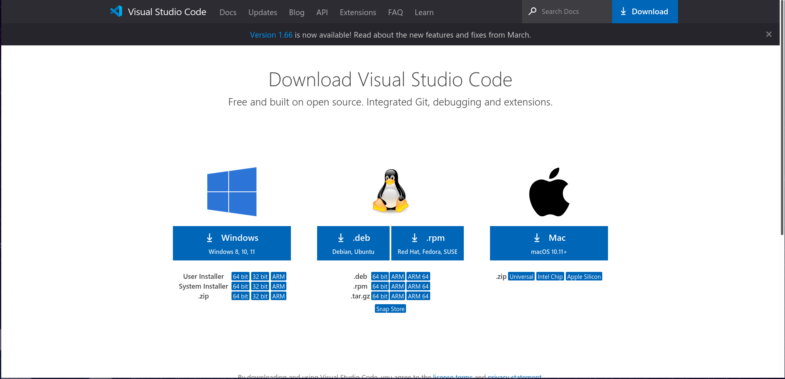
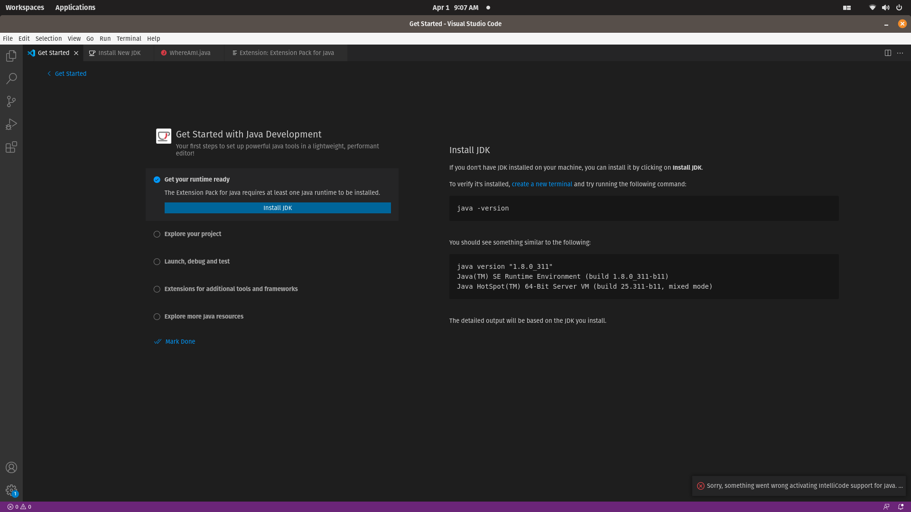
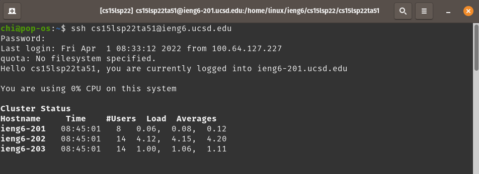
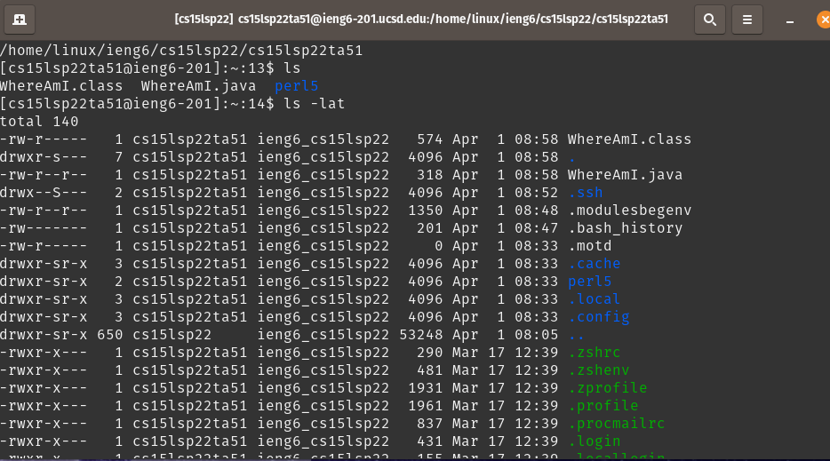
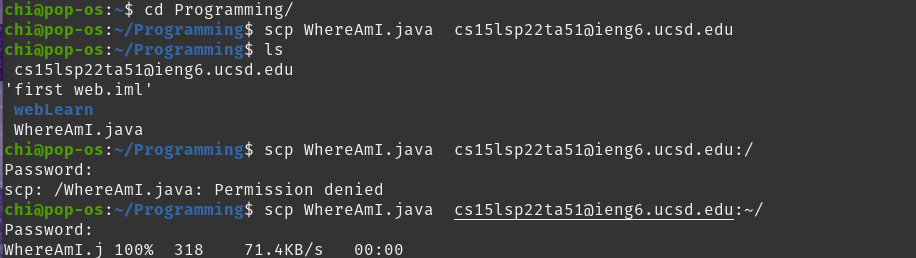
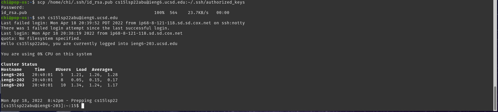
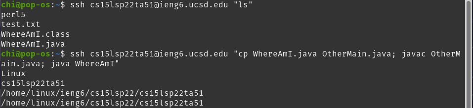

# Part 1- Installing VScode

Install Visual Studio or Visual Studio Code from the internet,
  by simply google "Visual Studio Code" and select version for your Operation.

# Part 2- Remotely Connecting
First, look up your course-specific account for CSE15L here: 
https://sdacs.ucsd.edu/~icc/index.php 
Then, use super+T to open a terminal and connect to the server by using `ssh [server_account]` command and input the password. 
if connected sucessfully, terminal should display something similar:
  

# Part 3- Trying Some Commands
Commands that can be used in local terminal can also be used while connecting to a server.

The only difference is that command would be operate on the server.

# Part 4- Moving Files with scp
`scp` is a useful command for copying files between servers , `scp` is always run from the client side. The format of the command is  
`scp [file_name] [server_account]`

# Part 5- Setting an SSH Key
whenever a user try to log in to a server, user needs to retype the password, which is annoy and time consuming. 
a way to solve this repetitive action is setting up a SSH Key.
by using `ssh-keygen` on client side, the computer generate a pair of keys, public key and private key on local computer.
  After that, create a dictory called `.ssh` on the remote account.
and copy the public key from local computer to server using `scp`.
 After copying public key, you should be able to log in without inputting password.

# Part 6- Optimizing Remote Running
Instead of logging in server accout to do a few command then quitting it, you can use run command on server by simply add command after `ssh` line.
And even doing multiple commands at the same line by using `;` to seperate commands.

